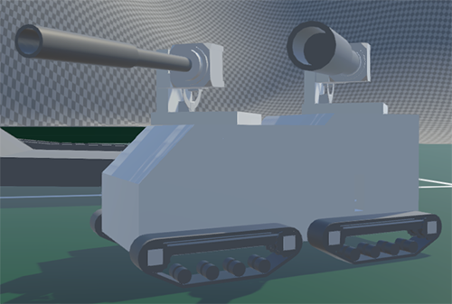
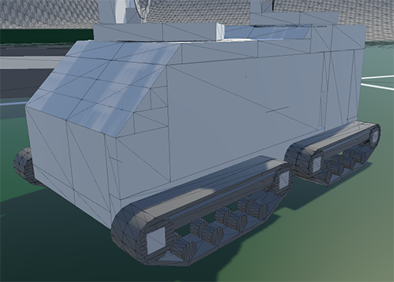
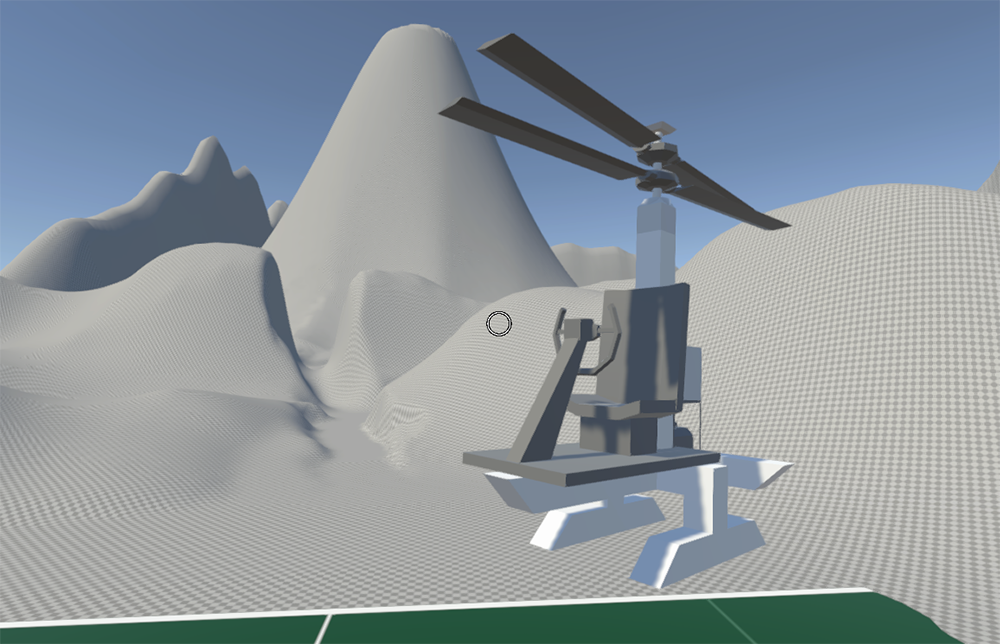

# Vehicle Base
## STILL IN DEVELOPMENT

Something I made for block-built vehicles in Unity. 
Might turn this into a library that's easy to use
(unlike this project) later. 

Can run around ~75 vehicles on a normal computer comfortably.

## Features
- Meshing optimized for small triangle count
- Collisions
- Checking for connected blocks
- Custom GameObject blocks for functional blocks
- Block parameter customization
- Ammo, Fuel, and Energy resource and resource use
- Block loading from XML
- Vehicle save/load from XML
- Armor-piercing damage model

## Block scripts for 
- Fuel Tank 
- Seat
- Turret Ring
- Engine
- Tracks
- Wheels
- Heliblades
- Ammo Rack (incomplete)
- Cannon (incomplete)
  
## TODO
- [ ] Damage bug against 
- [ ] Add different damage types
- [ ] Fix track physics
- [ ] Modding support

## Screenshots

What I see here                                     Mesh optimization

Vehicle with customized cannons   |  Mesh optimization
:--------------------------------:|:-------------------------:
  |  

Helicopter

